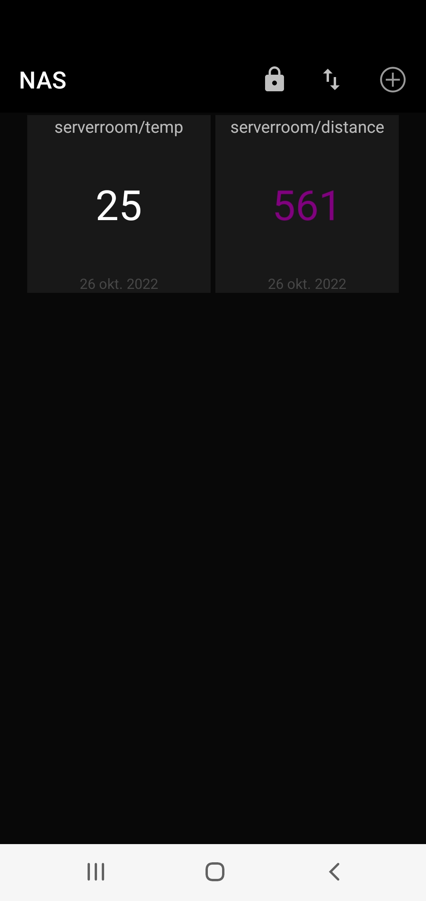

# tempdistancesensor
IoT-project

## Author: Kari Mäensivu

## Course: Applied Internet of Things (Professional Education), 4DV119, Linneus University, 2022

## Table of contents
[Project overview](#project-overview)

[Objectives](#Objectives)

[Material](#Material)

[Environment setup](#Environment-setup)

[Putting everything together](#Putting-everything-together)

[Platforms and infrastructure](#Platforms-and-infrastructure)

[The code](#The-code)

[The physical network layer](#The-physical-network-layer)

[Visualization and user interface](#Visualization-and-user-interface)

[Finalizing the design](#Finalizing-the-design)


### Project overview

The main goal was to learn more about IoT and programming a device to suit a specific purpose. This tutorial will explain how to build and program a device with sensors measuring air temperature, humidity and to some extent distance. This is a project in the course Applied Internet of Things (Professional Education) 4DV119 at Linnaeus University of Kalmar and Växjö.

### Objectives

The initial project idea was to build a device to measure the temperature in a server room. As the room has active cooling, the project expanded into also figuring out what causes fluctuations in temperature, hence a distance measurement sensor was added; in this case ultrasonic, in order to keep track of whether the door is open or there is some activity in the room.

### Material

For this project you need a micro controller with Wi-Fi support, a temperature sensor and distance sensor, I also included an OLED-display as it's convenient to see the temperature without having to access a dashboard when entering the server-room and the display was included in a package deal from Amazon, purchasing 5 of something at a time from Amazon also lowers the price per unit as you can see in below table. 

| Component | Price (SEK) | Store | Description |
| --- | --- | --- | --- |
| ESP32 Dev Kit C V4 NodeMCU WLAN WiFi | 80-125 | [Amazon](https://www.amazon.se/-/en/dp/B07Z849GM6/ref=d_pd_sbs_sccl_2_1/259-1576202-9124007?pd_rd_w=b8iE9&content-id=amzn1.sym.fb698345-6b4d-4736-bd59-f8a51d1d7df0&pf_rd_p=fb698345-6b4d-4736-bd59-f8a51d1d7df0&pf_rd_r=XPBE6SW5MVX9J5BPKBP3&pd_rd_wg=VopMI&pd_rd_r=ef999486-8354-43da-a88f-db89ff25bff2&pd_rd_i=B07Z83H831&th=1) | ESP32 Dev board from AZDelivery |
| DHT11 sensor | 50 | [Electrokit](https://www.electrokit.com/produkt/digital-temperatur-och-fuktsensor-dht11/) | Temperature sensor |
| HC-SR04 sensor | 60 | [Electrokit](https://www.electrokit.com/produkt/avstandsmatare-ultraljud-hc-sr04-2-400cm/) | Ultrasonic distance sensor |
| 0,96" OLED 128x64 display | 45-75 | [Amazon](https://www.amazon.se/-/en/dp/B074NJMPYJ/ref=d_pd_sbs_sccl_2_4/259-1576202-9124007?pd_rd_w=TuBGr&content-id=amzn1.sym.fb698345-6b4d-4736-bd59-f8a51d1d7df0&pf_rd_p=fb698345-6b4d-4736-bd59-f8a51d1d7df0&pf_rd_r=W2XYRSB2C4EDV1AGC3JQ&pd_rd_wg=jL863&pd_rd_r=b4358448-f21b-4d54-90cd-75814ff4eeb2&pd_rd_i=B01L9GC470&th=1) | OLED LCD display from AZDelivery |
| 400-pin breadboard with power rails | 20-55 | [Amazon](https://www.amazon.se/-/en/dp/B07VFK5CRP/ref=pd_bxgy_img_sccl_1/259-1576202-9124007?pd_rd_w=EzCP6&content-id=amzn1.sym.ac31a142-07ec-4ec2-a56a-32921a0c41c2&pf_rd_p=ac31a142-07ec-4ec2-a56a-32921a0c41c2&pf_rd_r=QRV6XEPSV9BZXD5Q61RM&pd_rd_wg=P4O6X&pd_rd_r=ee889612-bb53-4d9e-a888-5cc6a93dfc21&pd_rd_i=B07VFK5CRP&th=1) | Breadboard for quick installation of electronic circuits |
| Old cellphone charger 5V 1A output and USB-cable | ? | Laying around | For configuration and power supply |

### Environment setup

I used [Thonny](https://thonny.org/) as my code editor. It's open source and has Python 3.? (64-bit edition has version 3.10) built in, but you're able to use a separate Python installation if you so wish. I followed the guides on [external tutorial](https://randomnerdtutorials.com/getting-started-thonny-micropython-python-ide-esp32-esp8266/) to flash the ESP32 with the latest [firmware](https://micropython.org/download/esp32/). After that, you're able to connect the board with your computer. 

I only edited the boot.py and main.py, the other files used(hcsr04.py and ssd1306.py) are for the sensor and display respectively.

### Putting everything together

I used a breadboard with power rail, first connect the 5V output to the power rail(+). Then connect wires 1 through 11 as depicted in figures below. Wires 4, 7 and 11 should be connected to the powered part of the power rail. I could have used the internal temperature sensor of the ESP32 board, but chose the DHT11 sensor as the heat generation of the Wi-Fi module may affect temperature readings.

ESP32 Board


hc-sr04


DHT11


I2C


### Platforms and infrastructure

The device supports Wi-Fi and Bluetooth, but I've chosen Wi-Fi as the network structure is already in place and the device will be in the server room. I've also set up a MQTT broker on the local network. I've also set up a digital visual board, [Mevisio](https://www.mevisio.com/), to function as an external dashboard and database. Mevisio is a paid service, but as our company is partnered with them there is no extra cost in this case. An option would have been to use Grafana or AWS.


### The Code

A brief explanation of the code is that it reads the sensors, shows it on the display and then checks for any changes in temp, humidity or any of the pre-determined distance ranges. If there's been a change, it posts the data as json to an endpoint in Mevisio.

Main part of which is this, using urequests library.
```
def dataToMevisio(temp,distance,humidity):
    post_data = { "temp": temp, "distance": distance, "humidity": humidity}
    header_data = {"authorization": 'not_provided_here', "Content-Type": 'application/json'}
    print(post_data)
    req = requests.post(get_url(), json=post_data, headers=header_data)
    req.status_code
    req.close()
```
It's important to close the connection afterwards, otherwise it will fail next time.

### The physical network layer

The device connects to the Wi-Fi on boot, every 15 seconds data is posted to a MQTT-broker on the LAN. If any of the measurements have changed since the last time then the latest data is also posted to Mevisio via https. Basically I'm only storing changes on Mevisio. As it's indoors and the Wi-Fi connection is stable there was no reason to consider any other alternatives. If the device is outdoors or your Wi-Fi details are sensitive, then you should consider other alternatives as the Wi-Fi connection details are stored on the device.

### Visualization and user interface

I'm using Mevisio, it's a digital platform for data visualization. 

Mevisio digital board


Data is stored in a NoSQL and displayed thanks to json-configured modules, see example below.
```
{
  "moduleType": "number",
  "alias": "esp32-iot-dashboard",
  "name": "IoT project dashboard",
  "dataSource": "esp32-iot",
  "layout": [
    {
      "value": {
        "$max": "temp"
      },
      "label": "Max temp",
      "row": 1,
      "col": 1
    },
    {
      "value": {
        "$avg": "temp"
      },
      "label": "avg temp",
      "row": 2,
      "col": 1
    },
    {
      "value": {
        "$min": "temp"
      },
      "label": "min temp",
      "row": 3,
      "col": 1
    },
    {
      "value": {
        "$max": "distance"
      },
      "label": "max distance",
      "row": 4,
      "col": 1
    },
    {
      "value": {
        "$avg": "distance"
      },
      "label": "avg distance",
      "row": 5,
      "col": 1
    },
    {
      "value": {
        "$min": "distance"
      },
      "label": "min distance",
      "row": 6,
      "col": 1
    },
    {
      "value": {
        "$max": "humidity"
      },
      "label": "max humidity",
      "row": 1,
      "col": 2
    },
    {
      "value": {
        "$avg": "humidity"
      },
      "label": "avg humidity",
      "row": 2,
      "col": 2
    },
    {
      "value": {
        "$min": "humidity"
      },
      "label": "min humidity",
      "row": 3,
      "col": 2
    },
    {
      "value": {
        "$count": "distance"
      },
      "label": "# of records",
      "row": 4,
      "rowSpan": 2,
      "col": 2
    }
  ]
}
```

Can also set up Mevisio to send e-mail or message via Teams/Slack based on configurable events. But that's a future concern.


When connected to the LAN with my phone, I can also check the MQTT dashboard



### Finalizing the design

Device in a 3d-printed box(not optimal fit yet).


From above


I'm happy with what's been done so far, but might change the distance sensor to Lidar to be certain of the distance measurement as there could be something else interfering when using sonar. In addition, an alert system would be good to have.
